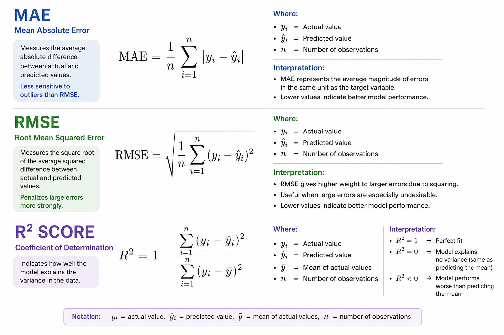

# 🏡 French Real-Estate Property Value Predictor
**Find the best properties in France for your investment!**

## 📌 Project Overview
Many real estate investors struggle to decide **what to buy** and **where to invest** to maximize their return on investment (ROI).

This project introduces a **data-driven application** that helps investors:
- Predict property values  
- Identify high-potential locations and properties based on a budget
- Get real-time property recommendations  

## ❗ Problem
Real Estate Investors in France would like to know what and where to buy for best ROI.

## ❓ Key Questions
- Which property to purchase? Which property characteristics?
- Where to invest?  
- When to purhcase?
- What is the expected rental value?  
- Want to maximize ROI with a specific budget?
- Which properties to avoid?
- Want real-time property listings recommendations?  

## 🧠 Methodology
To answer these questions, we used:
- **Flat files:** 6 year datasets of French real estate transactions  
- **APIs** External data sources for Rental prices
- **Web Scraping** SeLoger.com to extract real-time property listing 
- **Machine learning models** to predict the property value
- **Python** and **SQL** to analyse the data
- **Flask** to build the frontend of the app deployment


## 🎯 Objective
To assess, predict and recommend what and where to invest in French real-estate properties for best ROI based on a given budget so even small investors can start investing more in France. 

To **assess, predict and recommend the best real estate investments in France**, we input:
        - Budget  (gauge)
        - Location  (map)
        - Property characteristics  (text input)


## ⚙️ Installation (requirements.txt)
```bash
!pip install -r requirements.txt
```
Install using git Bash:
- pandas==2.1.4
- numpy==1.26.4
- matplotlib==3.8.2
- seaborn==0.13.2
- jupyter==1.0.0
- requests==2.31.0
- beautifulsoup4==4.12.3
- lxml==5.1.0
- sqlalchemy==2.0.25
- pymysql==1.1.0
- mysql-connector-python==8.3.0
- flask==2.3.3
- flask-restful==0.3.10
- python-dotenv==1.0.1
- google-cloud-bigquery==3.17.2
- scikit-learn==1.3.2


## Data
This dataset contains real-estate transactions across France between 2020 2nd Semester and 2025 1st Semester, including mainland and overseas areas.


## Data Sources
### Flat files: DVF 2020-S2 to 2025-S1
6 Text files of **Demande Valeurs Foncieres** concatinated into one large file CSV file

TXT files:

        - ValeursFoncieres_2020-S2
        - ValeursFoncieres_2021
        - ValeursFoncieres_2022
        - ValeursFoncieres_2023
        - ValeursFoncieres_2024
        - ValeursFoncieres_2025-S1

### API: Geospatial for rental prices by location in France

### WEB SCRAPING: SeLoger.com (real-time property listings for recommendations)

### MySQL database:(Entity Relational Diagram using MySQL workbench)
HERE add images of: 
- SQL querries and insights
- Entity Relational Diagram with at least 4 entities and 3 relationships

### DATA TABLE
| #  | Original Name           | Standard Name            | Description                                       | Data Type      | Variable Type                          |
| -- | ------------------------------ | ----------------------- | ------------------------------------------------- | -------------- | ----------------------------- |
| 0  | (derived after seeing that **No disposition** is unreliable)             | `transaction_id`        | Unique identifier of the transaction              | string         | Categorical / identifier      |
| 1  | **Date mutation**              | `transaction_date`      | Date when the property was sold                   | datetime64[ns] | Temporal                      |
| 2  | **Nature mutation**            | `transaction_type`      | Nature of transaction (sale, exchange, etc.)      | string         | Categorical                   |
| 3  | **Valeur fonciere**            | `property_value`        | Transaction price in euros                        | Float64        | Numeric (**TARGET**)          |
| 4  | **No voie**                    | `street_number`         | Street number of the property                     | string         | Categorical / identifier      |
| 5  | **B/T/Q**                      | `btq_code`              | Building / Type / Quarter code                    | string         | Categorical                   |
| 6  | **Type de voie**               | `street_type`           | Type of street (Rue, Avenue, etc.)                | string         | Categorical                   |
| 7  | **Code voie**                  | `street_id`             | Street identifier code                            | string         | Categorical / identifier      |
| 8  | **Voie**                       | `street_name`           | Full street name                                  | string         | Categorical                   |
| 9  | **Code postal**                | `postal_code`           | Postal code                                       | string         | Categorical / geographic code |
| 10 | **Commune**                    | `com_name`              | Commune name                                      | string         | Categorical                   |
| 11 | **Code departement**           | `dep_code`              | Department code                                   | string         | Categorical / geographic code |
| 12 | **Code commune**               | `com_code`              | Commune code                                      | string         | Categorical / geographic code |
| 13 | **Prefixe de section**         | `section_prefix`        | Section prefix used in cadastral identification   | string         | Categorical / cadastral code  |
| 14 | **Section**                    | `section`               | Cadastral section identifier                      | string         | Categorical / cadastral code  |
| 15 | **No plan**                    | `plot_number`           | Parcel / plot number                              | string         | Categorical / identifier      |
| 16 | **No Volume**                  | `volume_number`         | Volume number for special cadastral cases         | string         | Categorical / identifier      |
| 17 | **1er lot**                    | `lot_1`                 | Identifier of the first lot                       | string         | Categorical / identifier      |
| 18 | **Surface Carrez du 1er lot**  | `lot_1_surface`         | Carrez surface of the first lot in square meters  | Float64        | Numeric                       |
| 19 | **2eme lot**                   | `lot_2`                 | Identifier of the second lot                      | string         | Categorical / identifier      |
| 20 | **Surface Carrez du 2eme lot** | `lot_2_surface`         | Carrez surface of the second lot in square meters | Float64        | Numeric                       |
| 21 | **3eme lot**                   | `lot_3`                 | Identifier of the third lot                       | string         | Categorical / identifier      |
| 22 | **Surface Carrez du 3eme lot** | `lot_3_surface`         | Carrez surface of the third lot in square meters  | Float64        | Numeric                       |
| 23 | **4eme lot**                   | `lot_4`                 | Identifier of the fourth lot                      | string         | Categorical / identifier      |
| 24 | **Surface Carrez du 4eme lot** | `lot_4_surface`         | Carrez surface of the fourth lot in square meters | Float64        | Numeric                       |
| 25 | **5eme lot**                   | `lot_5`                 | Identifier of the fifth lot                       | string         | Categorical / identifier      |
| 26 | **Surface Carrez du 5eme lot** | `lot_5_surface`         | Carrez surface of the fifth lot in square meters  | Float64        | Numeric                       |
| 27 | **Nombre de lots**             | `lots_count`            | Number of lots in the transaction                 | Int64          | Numeric count                 |
| 28 | **Code type local**            | `property_type_code`    | Code for property type                            | string         | Categorical code              |
| 29 | **Type local**                 | `property_type`         | Property type (Apartment, House, etc.)            | string         | Categorical                   |
| 30 | **Surface reelle bati**        | `building_real_surface` | Built area in square meters                       | Float64        | Numeric                       |
| 31 | **Nombre pieces principales**  | `main_rooms_count`      | Number of main rooms                              | Int64          | Numeric count                 |
| 32 | **Nature culture**             | `land_nature`           | General type of land usage                        | string         | Categorical                   |
| 33 | **Nature culture speciale**    | `land_nature_special`   | Specific type of land usage                       | string         | Categorical                   |
| 34 | **Surface terrain**            | `land_surface`          | Land area in square meters                        | Float64        | Numeric                       |
| 35 | *(derived)*                    | `surface_type`          | Type of surface: building / land / combined       | string         | Derived categorical           |
| 36 | *(derived)*                    | `effective_surface`          | sum of the surfaces (building and land)       | Float64         | Derived numeric           |
| 37 | *(derived)*                    | `value_per_m2`          | value devided by effective_surface        | Float64         | Derived numeric           |
| 38 | *(derived)*                    | `longitude`          | longitude of property       | Float64         | Derived numeric           |
| 39 | *(derived)*                    | `latitude`          | Latitude of property       | Float64         | Derived numeric           |
| 40 | *(derived)*                    | `com_type`          | Commune type       | string         | Derived categorical           |
| 41 | *(derived)*                    | `insee_code`          | insee_code is either DDCCC (mainland) or DDDCC (overseas)       | Float64         | Derived categorical           |
| 42 | *(derived)*                    | `transaction_year`          | The year the transaction was made (for ML)       | int         | Derived categorical           |
| 43 | *(derived)*                    | `transaction_month`          | The month the transaction was made (for ML)       | string         | Derived categorical           |
## Exploratory data analysis (EDA)
This repository structure contains the EDA where each notebook is a key step.

**0. DATA COLLECTION & EXPLORATION**

**1. DATA CLEANING**

        1.1. CREATE new unique TRANSACTION ID 
        1.2. CONCAT files and convert into 1 CSV
        1.3. STANDARDIZE column names
        1.4. Deal with INVALID VALUES
        1.5. CONVERT dtypes
        1.6. Deal with NULLS
        1.7. Deal with DUPLICATES: removed true duplicate rows and only kept first occurence with non duplicate rows from the dataset.
        1.8. Deal with OUTLIERS
        1.9. SAVE CLEAN FILE

**2. WEB SCRAPING (SeLoger.com)**

**3. DATA ANALYSIS & HYPOTHESIS TESTING**


## Machine Learning (ML)
STEPS :

        1. DATA PREPROCESSING
        2. MODELS EVALUATION
        3. DEPLOYMENT

### ML Problem Type
It's a REGRESSION PROBLEM.

### DATA REVISION
Since the dataset is large, it may be difficult to use it whole for Machine Learning.

### TARGET & FEATURES
#### **THE TARGET** (**Valeur foncière** == `property_value`) : 

        - It's the transaction amount in EUROS. 
        - This amount does not include notary fees and agency fees because it ultimately corresponds to the value of the property in a transaction whether it was a sale or exchange. 
        - This amount is inclusive of VAT.

#### **FEATURES** (`Property characteristics`)
These are the selected features:

**CATEGORICAL Features:**

        - `transaction_year`: 
                - 2020, 2021, 2022, 2023, 2024, 2025
        
        - `transaction_month`: 
                - JAN, FEB, MAR, APR, MAY, JUN, JUL AUG, SEP, OCT, NOV, DEC
        
        - `transaction_type`:

                - Sale in future state of completion
                - Sale of unbuilt land
                - Sale
                - Expropriation
                - Auction
                - Exchange

        - `property_type`: 
                - House
                - Apartment
                - Industrial or commercial premises
                - Outbuilding
                - Unknown

        - `surface_type`: 
                - building
                - land
                - combined
                - Unknown
        - longitude
        - latitude
        - 
 **NUMERIC Features:**
        -
        -

### Data Preparation for Machine Learning
Since we handled invalid values, missing values, duplicates, and outliers in the EDA step data cleaning
We only need to focus on preprocessing for the sake of Machine Learning and created a new CSV file `ML_ValeursFoncieres.csv`
        - Number of rooms is null i.e there is no room so we fill nan with 0
        - The target `property_value` has null values so in order to work with scikitlearn we filter them
        - Label missing categorical data

### Data Preprocessing
        1. Drop Columns 
                - with mostly null values
                - with ID and future information
        2. Split data to Train/Test sets
        3. Feature Engineering & Feature Scaling
        4. Derive New Features


### Models Results Evaluation
After training different models, record their results in a Google Sheet for later to rank

The models:
        - **Baseline**
        - **Linear Regression**
        - **XGBoost**
        - **CatBoost**
        - **LightGBM**

#### ML Model Evaluation Metrics (KPI)
`Note: Evaluate the model on the test data.`

For this regression problem, we use the following metrics:
- **R² Score,** To note that the R² value must be greater than 0 and in the best case 1 
- **Mean Absolute Error (MAE),**
- **Root Mean Squared Error (RMSE).**



Let's compare the models results:


### Deployment
        - After comparing models results, evaluate and select the best model to be used for deploying our app.


## Limitations
        - Almost half the dataset has an "Unknown" property type

## Conclusions
        - Best property types to invest in is:
        - Best locations to invest in are:

## Future Improvements
        - Dataset preprocessing must be improved further to produce better result.
        - Using only the top best important features with algorithm can improve model performance
        - To webscrape from different sources such as agencies
        - API Transport for distance calculation
        - API Amenities for granular assessment of Property Neighbourhood value 


## Author
        Mme BOUBAYA Samia

## Version Control & Date 
        Version 01: April 2026